# Regression Prediction and Modeling Suite



This repository contains a comprehensive suite for regression modeling, analysis, and prediction. It is designed to demonstrate both theoretical mathematical modeling and real-time interactive predictions. 

The suite is divided into two primary systems:
1. **Python Analytical Pipeline**: A statistical script that models advertising spending versus sales, comparing simple linear regression against second-degree polynomial regression to capture non-linear diminishing returns.
2. **TypeScript Web Application**: A client-side React-based workbench that solves multiple linear regression matrices using Ordinary Least Squares (OLS) directly in the browser, providing a sandbox for defining schemas, training custom models, and evaluating predictions.

---

## Directory Structure

```text
AI_Sales/
│
├── polynomial_regression.py          # Python analytical script
├── advertising.csv                   # Historical advertising and sales dataset
│
├── visualizations/
│   ├── banner.svg                    # Animated dashboard graphic
│   └── tv_diminishing_returns.png    # Matplotlib analysis visualization
│
└── regression-prediction-tool/       # Interactive TypeScript React frontend
    ├── src/
    │   ├── components/               # UI views (Dashboard, Training Lab, Predictor)
    │   ├── utils/math.ts             # OLS and polynomial solver mathematical logic
    │   └── App.tsx                   # Main React routing and state container
    ├── package.json
    └── vite.config.ts
```

---

## Python Analytical Pipeline

The script `polynomial_regression.py` performs exploratory data analysis and fits predictive models using historical advertising budgets (TV, Radio, Newspaper) to project sales.

### Mathematical Objectives
* **Simple Linear Fit**: Establish a baseline multi-variable linear model.
* **Polynomial Fit (Degree 2)**: Capture the concave curvature of TV advertising budgets representing diminishing returns on investment.
* **Marginal Utility Threshold**: Calculate the exact investment limit where the derivative of the sales curve falls below a defined threshold (e.g., $0.02 units of sales per dollar spent).

### Setup and Execution

1. **Install Dependencies**:
   ```bash
   pip install pandas numpy scikit-learn matplotlib seaborn
   ```

2. **Run the Script**:
   ```bash
   python polynomial_regression.py
   ```

3. **Analysis Output**:
   * Displays $R^2$ scores and Mean Squared Error (MSE) metrics comparing both models.
   * Generates a plot saved as `visualizations/tv_diminishing_returns.png` demonstrating the curvilinear fit of polynomial regression compared to the linear model.
   * Identifies the optimal budget ceiling before diminishing returns reduce efficiency.

---

## TypeScript Interactive Web Application

The `regression-prediction-tool` directory contains an interactive dashboard. It allows users to simulate inputs, examine underlying equations, and train new models with custom coordinate datasets.

### Highlights
* **Client-Side Matrix Solver**: Solves Ordinary Least Squares (OLS) linear algebra equations dynamically in the browser using raw TypeScript matrices.
* **Dynamic Configurator**: Customize features, labels, step intervals, and target metrics dynamically.
* **Micro-Animations**: Uses Motion (Framer Motion) for fluid transitions, results calculations, and dynamic equation expansions.
* **History Logger**: Record queries, inputs, and predictions during the active session.

### Running Locally

1. **Navigate to the web application directory**:
   ```bash
   cd regression-prediction-tool
   ```

2. **Install node modules**:
   ```bash
   npm install
   ```

3. **Launch the development server**:
   ```bash
   npm run dev
   ```
   Open `http://localhost:3000` to view the workbench.

---

## Core Mathematical Concepts

### Polynomial Curve Fitting
Linear models assume a constant slope. However, real-world media spends show that initial expenditures yield high returns, which plateau as markets saturate. By introducing quadratic terms:

$$Y = \beta_0 + \beta_1 X_1 + \beta_2 X_1^2 + \dots$$

The model captures the concave trajectory, allowing teams to avoid over-allocating funds.

### Ordinary Least Squares (OLS) Solver
The web application uses the closed-form matrix equation to estimate the weight coefficient vector $\beta$:

$$\beta = (X^T X)^{-1} X^T Y$$

Where:
* $X$ is the input data matrix appended with a column of ones for the intercept bias.
* $Y$ is the vector of target outputs.
* $\beta$ contains the solved intercept and coefficient weights.
